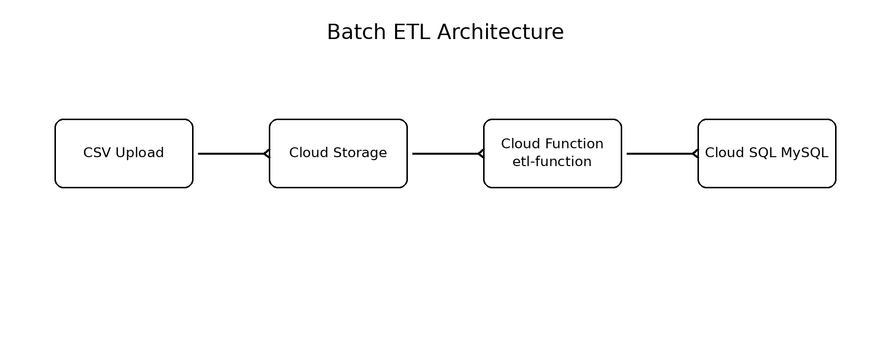
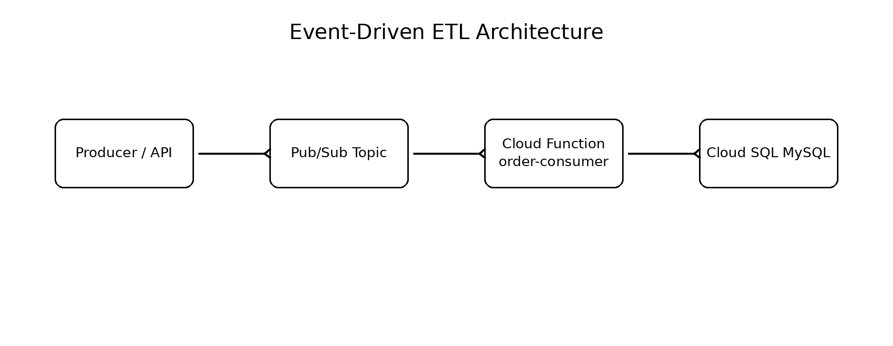
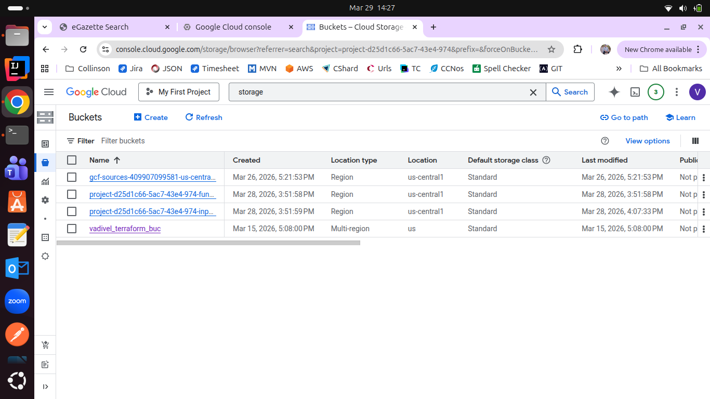
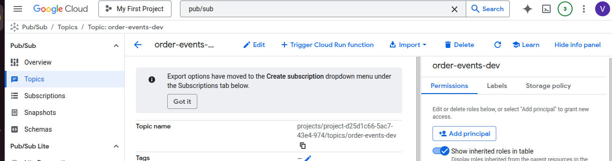
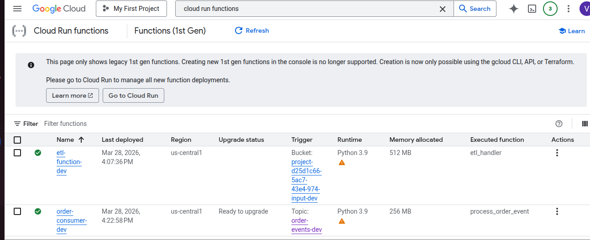
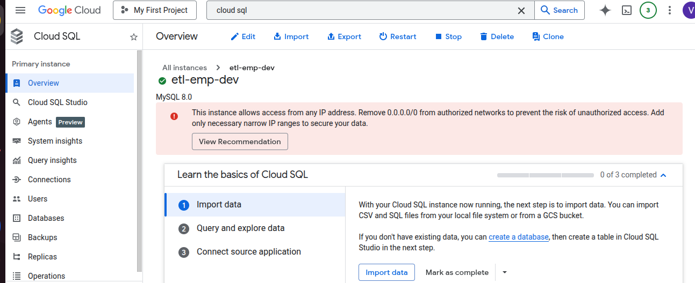
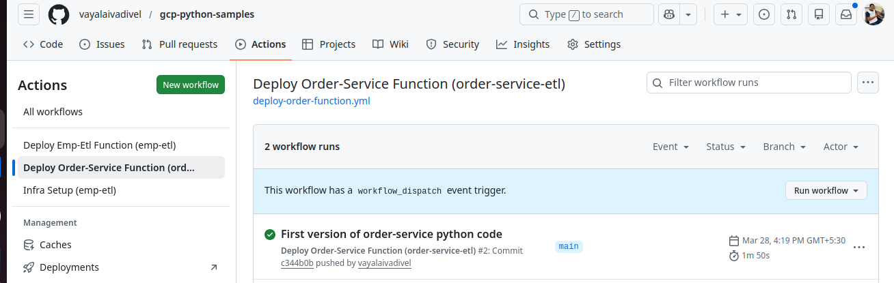
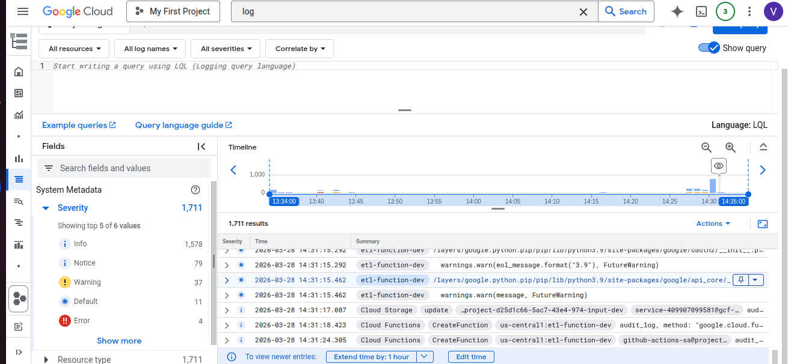

# 🚀 GCP Serverless ETL Platform (Batch + Event-Driven)


> A portfolio-quality GCP project showing both **batch ETL** and **event-driven ETL** with **Terraform**, **GitHub Actions**, **Cloud Functions**, **Cloud Storage**, **Pub/Sub**, **Cloud SQL**, and **Secret Manager**.

---

## ✨ Why this repo stands out

- **Two real pipelines in one repo**
  - `emp-etl` → batch CSV ingestion
  - `order-service-etl` → real-time order event processing
- **Infrastructure as Code**
  - Full provisioning with Terraform
- **CI/CD ready**
  - GitHub Actions deploy workflows
- **Production-minded design**
  - Secret Manager, service accounts, IAM, reusable env-based deployment
- **Strong Data Engineer portfolio value**
  - batch + streaming + cloud + automation

---

## 📌 Overview

This repository implements a **serverless ETL platform on Google Cloud Platform (GCP)**.

### 1) Batch ETL — `emp-etl`
When a CSV file is uploaded to a Cloud Storage bucket, a Cloud Function is triggered to parse the file and load employee data into Cloud SQL (MySQL).

### 2) Event-Driven ETL — `order-service-etl`
When an order event is published to a Pub/Sub topic, a Cloud Function consumes the message, validates the payload, and writes the order into Cloud SQL (MySQL).

---

## 🏗️ Architecture Diagrams

### Batch ETL


### Event-Driven ETL


---

## ☁️ Cloud Console screenshots

I cannot generate real Cloud Console screenshots from your GCP account here, but this README is structured so you can add them directly once captured.


#### Cloud Storage bucket



#### emp-etl Cloud Function


#### Pub/Sub topic



#### order-service Cloud Function


#### Cloud SQL instance



#### GitHub Actions deployment


#### Function logs


---

## 🔄 End-to-end flow

### Batch flow (`emp-etl`)
1. Upload CSV to Cloud Storage
2. Cloud Storage finalize event triggers Cloud Function
3. Function parses CSV
4. Function reads DB credentials from Secret Manager
5. Rows are inserted into Cloud SQL

### Event flow (`order-service-etl`)
1. Producer publishes order JSON to Pub/Sub
2. Topic event triggers Cloud Function
3. Function decodes Pub/Sub payload
4. Function validates / transforms event
5. Order row is inserted or updated in Cloud SQL

---

## 📂 Project structure

```text
.
├── emp-etl
│   ├── src
│   │   ├── main.py
│   │   └── requirements.txt
│   └── test
│       └── emp.csv
├── infra
│   ├── backend.tf
│   ├── env
│   │   ├── dev.tfvars
│   │   └── prod.tfvars
│   ├── main.tf
│   ├── output.tf
│   ├── provider.tf
│   └── variables.tf
├── order-service-etl
│   ├── src
│   │   ├── main.py
│   │   └── requirements.txt
│   └── test
│       └── publish_order.py
├── architecture-batch.png
├── architecture-event.png
└── README.md
```

---

## ⚙️ Tech stack

| Layer | Technology |
|---|---|
| Compute | Cloud Functions |
| Batch Input | Cloud Storage |
| Event Input | Pub/Sub |
| Database | Cloud SQL (MySQL) |
| Secrets | Secret Manager |
| IaC | Terraform |
| CI/CD | GitHub Actions |
| Language | Python |

---

## 🔐 Security

- DB password stored in **Secret Manager**
- Functions run with dedicated **service accounts**
- Access controlled using **IAM**
- No plaintext credentials committed to source control

---

## 🚀 Deployment

### Provision infrastructure

```bash
cd infra
terraform init
terraform apply -var="env=dev" -var-file="env/dev.tfvars"
```

### Deploy function code with GitHub Actions
Push code changes to `main` and the function-specific workflow deploys the updated source.

Typical workflows:
- `Deploy Emp-Etl Function (emp-etl)`
- `Deploy Order-Service Function (order-service-etl)`

---

## 🧪 Testing

### Test batch pipeline

Upload a sample CSV:

```bash
gcloud storage cp emp-etl/test/emp.csv gs://<input-bucket>
```

Check logs:

```bash
gcloud functions logs read etl-function-dev --region=us-central1
```

### Test event-driven pipeline

Publish an order event:

```bash
gcloud pubsub topics publish order-events-dev   --message='{"order_id":"ORD1001","customer_name":"Vadivel","product_name":"Laptop","quantity":1,"amount":65000,"status":"CREATED"}'
```

Check logs:

```bash
gcloud functions logs read order-consumer-dev --region=us-central1
```

---

## 🗃️ Data model

### Employee table (`emp`)
| Column | Description |
|---|---|
| emp_name | Employee name |
| dept | Department |
| salary | Salary |

### Orders table (`orders`)
| Column | Description |
|---|---|
| order_id | Unique order identifier |
| customer_name | Customer name |
| product_name | Product name |
| quantity | Quantity ordered |
| amount | Order amount |
| status | Order status |

---

## 💡 Advanced concepts demonstrated

- Event-driven architecture
- Batch and streaming patterns in one repo
- Idempotent order processing design
- Secret Manager integration
- Environment-based Terraform deployment
- CI/CD-based function delivery
- Cloud-native serverless ETL design

---

## ⚠️ Current limitations

- Cloud SQL uses public IP in dev-style setup
- No dead-letter queue yet for failed Pub/Sub events
- Designed for learning / portfolio / small workloads first

---

## 🔮 Roadmap

- Private Cloud SQL + VPC connector
- Dead Letter Queue (DLQ)
- BigQuery analytics layer
- Dataflow version for scale
- Monitoring dashboards and alerting
- End-to-end tests in CI
- Architecture screenshots from Cloud Console

---

## 🏆 Why this is a strong GitHub portfolio project

This repo shows:

- **Cloud platform skill** → GCP services working together
- **Data engineering skill** → batch + event ingestion
- **DevOps skill** → Terraform + CI/CD
- **Software engineering skill** → structured repo, reproducible deployment
- **Production thinking** → secrets, IAM, service accounts, logging

---

## 🎯 Interview explanation

> I built a hybrid ETL platform on GCP with two ingestion patterns. One pipeline processes CSV files from Cloud Storage using Cloud Functions, and the other consumes order events from Pub/Sub for near real-time processing. Both pipelines load into Cloud SQL, use Secret Manager for credentials, and are provisioned with Terraform and deployed via GitHub Actions.

---

## 📄 Resume bullet

Built a serverless ETL platform on GCP supporting both batch CSV ingestion and real-time Pub/Sub event processing using Cloud Functions, Cloud SQL, Secret Manager, Terraform, and GitHub Actions.

---

## 👨‍💻 Author

**Vadivel P M**