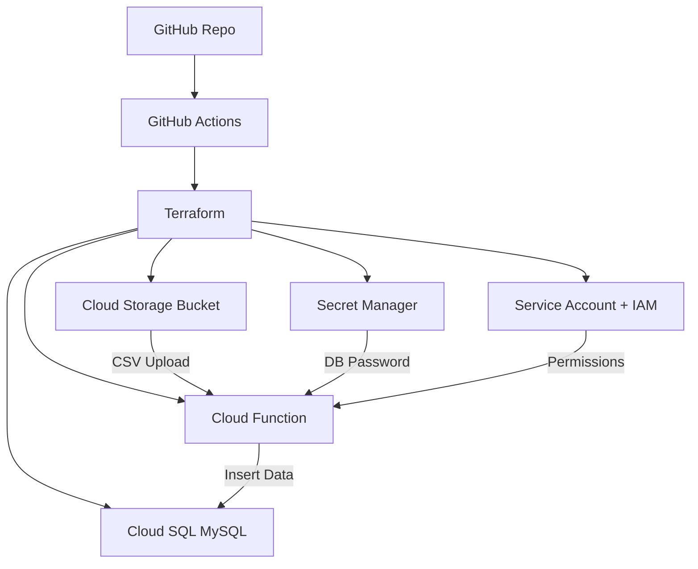

# 🚀 GCP Serverless ETL Pipeline (Advanced)


---

## 📌 Overview

This project implements a **production-style, event-driven ETL pipeline on GCP**.

When a CSV file is uploaded to a Cloud Storage bucket, a Cloud Function is triggered automatically to:
- validate and parse the file
- securely fetch DB credentials
- load data into Cloud SQL (MySQL)

Infrastructure is fully managed using **Terraform** and deployed via **GitHub Actions CI/CD**.

---

## 🏗️ Architecture Diagram



---

## 🔄 End-to-End Flow

1. Developer pushes code to GitHub
2. GitHub Actions runs Terraform
3. Infrastructure is provisioned:
   - GCS bucket
   - Cloud Function
   - Cloud SQL
   - Secret Manager
4. CSV uploaded to bucket
5. Cloud Function triggered
6. Function:
   - downloads CSV
   - validates schema
   - inserts data into MySQL

---

## 📂 Project Structure

```
emp-etl/
├── infra/
│   ├── main.tf
│   ├── variables.tf
│   ├── output.tf
│   └── env/
│       ├── dev.tfvars
│       └── prod.tfvars
│
├── src/
│   ├── main.py
│   └── requirements.txt
│
├── test/
│   └── emp.csv
│
└── docs/
    └── architecture.svg
```

---

## 📄 Sample CSV

```csv
emp_name,dept,salary
John Doe,Engineering,50000
Jane Smith,Finance,60000
```

---

## ⚙️ Tech Stack

| Layer | Technology |
|------|----------|
| Compute | Cloud Functions |
| Storage | Cloud Storage |
| Database | Cloud SQL (MySQL) |
| Secrets | Secret Manager |
| IaC | Terraform |
| CI/CD | GitHub Actions |
| Language | Python |

---

## 🔐 Security

- Secrets stored in **Secret Manager**
- Access via **Service Account**
- IAM roles:
  - storage.objectAdmin
  - secretmanager.secretAccessor

---

## 🚀 Deployment

```bash
cd emp-etl/infra
terraform init
terraform apply -var="env=dev" -var-file="env/dev.tfvars"
```

---

## 📤 Testing

```bash
gcloud storage cp test/emp.csv gs://<bucket>
gcloud functions logs read etl-function-dev --region=us-central1
```

---

## 📊 Output

- Database: `etl_db`
- Table: `emp`

---

## ✅ Features

- Event-driven architecture
- Serverless ETL
- Secure secrets management
- Infrastructure as Code
- CI/CD enabled

---

## ⚠️ Limitations

- Not optimized for large datasets
- Public DB access (demo only)

---

## 🔮 Future Enhancements

- Pub/Sub integration
- Dataflow for scaling
- BigQuery analytics
- VPC private SQL
- Monitoring & alerting

---

## 🎯 Interview Explanation

Built a serverless ETL pipeline on GCP using Cloud Storage, Cloud Functions, Cloud SQL, Secret Manager, Terraform, and GitHub Actions. Implemented event-driven CSV ingestion and secure data loading into MySQL.

---

## 📄 Resume Line

Developed a serverless ETL pipeline on GCP enabling automated CSV ingestion and secure data loading into MySQL using Terraform and CI/CD.

---

## 👨‍💻 Author

Vadivel P M
